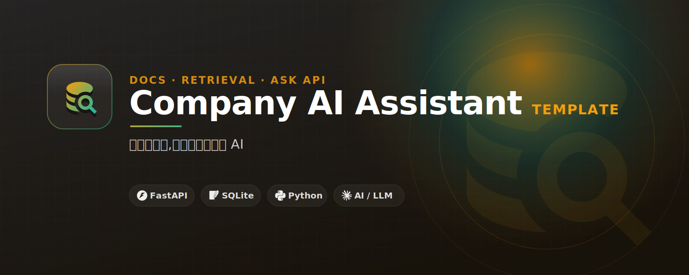

# Company AI Assistant Template

Build an internal document Q&A assistant before adding vector DB complexity.

## 繁中定位

**企業內部 AI 助理模板** 面向台灣繁中受眾。

- 主要受眾：適合想先驗證內部文件問答、SOP 查詢、知識庫助理的中小企業與工程團隊。
- 核心承諾：先用 SQLite + keyword retrieval 做出可展示的內部文件 AI 助理，再逐步升級成 RAG。
- CTA 頁：https://yazelin.github.io/company-ai-assistant-template/


## 公開教學文件

這個 repo 的教學內容直接公開，讓你可以先自己照著跑；如果需要手把手 debug、改成你的公司或個人場景，再考慮工作坊或顧問協助。

- 網頁版教學：https://yazelin.github.io/company-ai-assistant-template/tutorial.html
- Markdown 教學：[`docs/`](docs/)
- 快速開始：[`docs/01-quickstart.md`](docs/01-quickstart.md)
- 常見踩雷：[`docs/05-common-pitfalls.md`](docs/05-common-pitfalls.md)

## Who this is for

Small teams and companies that want a private AI knowledge assistant.

## Features

- FastAPI /ask endpoint
- SQLite document index
- Keyword retrieval baseline
- Provider adapter ready for LLM APIs

## Quick start

```bash
git clone https://github.com/yazelin/company-ai-assistant-template.git
cd company-ai-assistant-template
python -m venv .venv
source .venv/bin/activate
pip install -r requirements.txt
```

See the source files and `.env.example` for the minimal runnable path.

## Learn / get help

This repo is also a CTA page for workshops and consulting:

- GitHub Pages: https://yazelin.github.io/company-ai-assistant-template/
- Contact: yaze.lin.j303@gmail.com

## License

MIT


## Brand / CTA design

- Landing page: https://yazelin.github.io/company-ai-assistant-template/
- CI spec: [DESIGN.md](DESIGN.md)
- Banner: [assets/banner.svg](assets/banner.svg)
- Logo: [assets/logo.svg](assets/logo.svg)

---
## 關於作者

這個範本由 **林亞澤（Yaze Lin）** 維護 — 出身機電自動化系統整合，現在把同一套工程方法用在 AI 產品上。

- 任職於 **擎添工業 ChingTech**（1984 年成立的機電自動化公司：PLC 程式、機械手臂、AGV 無人搬運、半導體封測／PCB／面板／光學產線整合）。
- 技術筆記與更多範例：[yazelin.github.io](https://yazelin.github.io) · GitHub [@yazelin](https://github.com/yazelin)

## 從範本到正式產品

> 你正在看的「知識庫 + 檢索」範本，正式版是 CTOS 的知識庫與產業 Agent 模組。

如果你想看同樣的想法做成正式、上線中的產品：

- **CTOS** — 企業 AI 工作平台：macOS 風格 Web 桌面、知識庫 RAG 檢索、產業專屬 Agent、LINE Bot 整合，資料留在台灣。[ching-tech.com](https://ching-tech.com) · [品牌站](https://ching-tech.github.io)
- **CTOS-Lite / CT JINN** — 把公司裝進 LINE 的個人版 AI 助理，加 LINE 即可試用：[@285fjkky](https://line.me/R/ti/p/@285fjkky)
- **Mori Desktop** — 個人 AI 管家桌面應用（Tauri 2 + Rust + React）：[github.com/yazelin/mori-desktop](https://github.com/yazelin/mori-desktop)
- **AgentOS** — 跨 CLI 的 agent 治理平台（開發中）

> 想把這個範本落地成你公司的內部系統，或想上一堂從 0 到部署的課？
> 來信 yaze.lin.j303@gmail.com，或追蹤上面的連結。
